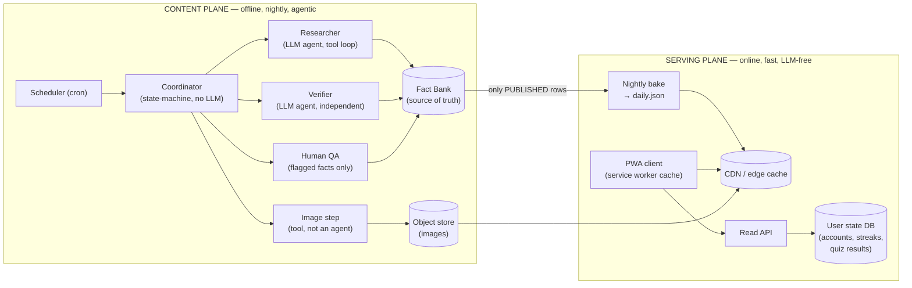
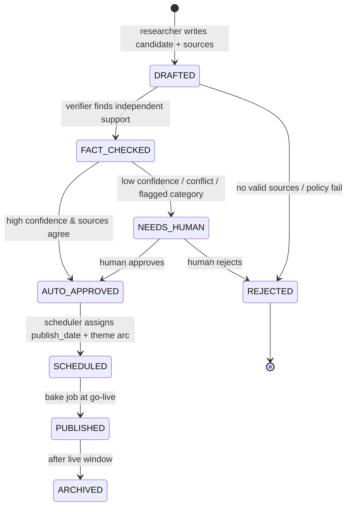
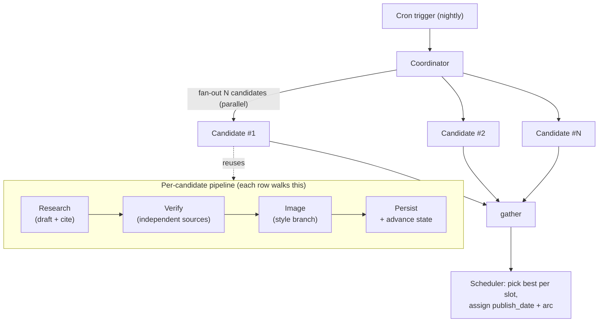
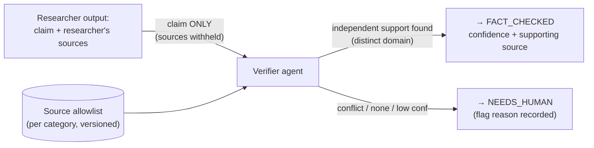
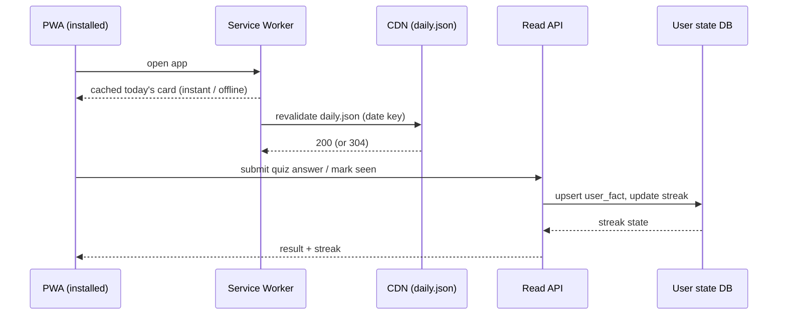
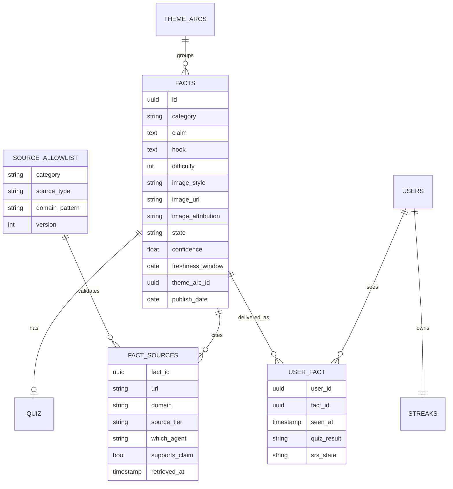

# Morsel — Architecture & Technical Design (v0.1)

*Morsel: one accurate, well-sourced, fun fact a day — a small tasty bite of world
knowledge. "Wordle for world knowledge."*

*Living document. Focus: architecture design for the MVP and the phases that follow.
Companion to the Product & Technical Spec (v0.1).*

---

## 1. Problem Statement

Morsel delivers **one accurate, well-sourced, fun fact per day** via an installable
PWA. The product bet is that a 30-second daily ritual compounds into real retained
knowledge, and that **trust** (every fact cited and verified) is the differentiator
against generic trivia apps.

The engineering problem is **not** the app. The daily-card UI is trivial. The hard
problems are:

1. **Producing trustworthy content at a daily cadence without a newsroom.** Facts
   must be researched, independently verified against a fixed source allowlist, and
   human-checked *only where risk warrants* — all by an automated pipeline that runs
   unattended most nights.
2. **Keeping the read path fast, cheap, and offline-capable** while the generation
   path is slow, expensive, and LLM-heavy.
3. **Building a content substrate** (the "fact bank") that supports later features —
   spaced repetition, connect-the-dots, personalization — without re-querying an LLM
   on every read.

This document specifies an architecture that isolates these concerns so the risky,
expensive content machinery can evolve independently of a dumb, fast serving layer.

---

## 2. Requirements (derived from the product spec)

### 2.1 Functional

| # | Requirement | Source |
|---|---|---|
| F1 | Deliver exactly one fact per day: claim + "why it matters" hook + image + visible citation. | Spec §4.1 |
| F2 | Optional guess-before-reveal micro-quiz per fact. | Spec §4.1 |
| F3 | Per-user streaks with a "streak freeze" allowance. | Spec §4.2 |
| F4 | Account-gated from day one. | Spec §8 |
| F5 | Nightly agentic pipeline: researcher → fact-checker → human QA gate → fact bank. | Spec §5, §7 |
| F6 | Per-category source allowlist, versioned in the schema; verification checks against it, not open web. | Spec §8 (Q1) |
| F7 | Human QA is spot-check, applied only to facts the checker *flags*. | Spec §8 (Q2) |
| F8 | Per-fact image style (`illustrated` vs `photo-realistic`), chosen during curation. | Spec §8 (Q3) |
| F9 | Weekly theme arcs (e.g. "Silk Road week"), not pure randomization. | Spec §4.2 |
| F10 | Email digest reminder (MVP); Web Push as fast-follow. | Spec §4.4, §7 |
| F11 | Today's card available offline (service-worker cached). | Spec §4.4 |

### 2.2 Non-functional

| # | Requirement | Rationale |
|---|---|---|
| N1 | **Read path is cache-first and LLM-free.** No model call on the request path. | Cost, latency, offline. Spec §6. |
| N2 | **Pipeline is idempotent and resumable.** A crash mid-run loses no completed work and re-pays for nothing. | Nightly LLM jobs fail partway constantly. |
| N3 | **Verification is auditable.** Every published fact retains the sources and the agent/confidence trail that approved it. | Trust is the product. |
| N4 | **Platform-agnostic backend + pipeline.** No coupling to PWA vs native. | Spec §2, §6 — native is a later frontend-only lift. |
| N5 | **Content buffer ≥ several days** ahead of publish. | A bad night must never produce an empty card. |
| N6 | Architected so personalization/SRS are *additive*, never a rewrite. | Spec defers them but wants them possible. |

### 2.3 Explicit non-goals (MVP)

Personalization agent · spaced-repetition resurfacing · connect-the-dots ·
knowledge-map visualization · internet-culture category (distinct freshness pipeline)
· native app + widgets. All deferred; see §10.

---

## 3. Solution Overview

### 3.1 Two planes, one membrane

Morsel is **two subsystems that share only a database**:

- **Content Plane** — offline, nightly, agentic, expensive, human-gated. Produces
  verified facts.
- **Serving Plane** — online, fast, cheap, cache-first, LLM-free. Delivers the daily
  card and tracks per-user state.

The **Fact Bank** is the membrane. The content plane *writes* facts and walks them to
a `PUBLISHED` state; the serving plane only ever *reads* `PUBLISHED` rows. Neither
plane calls into the other at runtime. This is the load-bearing decision of the whole
design (N1, N4).

### 3.2 The pipeline is a *deterministic* agentic workflow

The nightly pipeline is **not** an LLM orchestrator deciding what to do next. The
control flow (research → verify → image → persist) is fixed and known, so it lives in
**plain coordinator code that walks a state machine**. The LLM intelligence is
concentrated *inside* the steps that genuinely reason (the researcher's tool-using
loop; the verifier's independent search), not in the control plane.

Why deterministic control flow:

- **Resumability (N2)** — the database is the orchestrator's memory. Each stage
  checkpoints its output to the fact row and advances a state column. A crash after
  verification resumes at the image step; no completed LLM work is re-paid.
- **Enforceable guarantees (N3)** — e.g. "the verifier must not see the researcher's
  sources" is *structural* when the verifier is a function called with only the claim,
  versus a polite request a shared-context LLM orchestrator can violate.
- **Cost & debuggability** — the sequence is the same every night; making a model
  re-derive it buys nondeterminism and nothing else.

A true agentic orchestrator earns its place only if categories need *wildly*
divergent routing decided at runtime — not the case for MVP (all historical
categories share one pipeline; internet-culture is deferred).

### 3.3 Candidate over-provisioning

Each nightly run generates **N candidates per slot** (e.g. 5), each an independent
per-candidate pipeline run in parallel (fan-out/gather). The scheduler later assigns
the best `AUTO_APPROVED` candidate to a `publish_date`. This absorbs verifier and QA
rejections without leaving a hole in the calendar (N5), and keeps a multi-day buffer.

---

## 4. Architecture Diagrams

### 4.1 System context — two planes, one membrane



### 4.2 Content lifecycle — the state machine



Every stage is "find rows in state X, do work, checkpoint, advance." Idempotent and
resumable by construction (N2).

### 4.3 Nightly orchestration — fan-out over independent candidates



### 4.4 Verification — enforced independence



### 4.5 Read path — request flow



### 4.6 Data model (fact bank + user state)



---

## 5. Component Detail

### 5.1 Coordinator (control plane, no LLM)
A scheduled Python job. Queries the fact bank for rows in each state, invokes the
appropriate step, checkpoints results, advances state. Owns fan-out/gather and
parallelism. Stateless between runs — all state is in the DB.

### 5.2 Researcher agent (LLM, tool-using loop)
Given a category + arc context, drafts a candidate `{claim, hook, difficulty, quiz}`
and cites sources it actually retrieved. Genuinely agentic (search → read → draft →
cite). Writes a `DRAFTED` row with its `FACT_SOURCES` (`which_agent = researcher`).

### 5.3 Verifier agent (LLM, independent)
Receives the **claim only** — never the researcher's sources. Independently searches
the category's **allowlist** for support, emits `{confidence, supporting_source}`.
Independence rule (start crude, tighten later): support must come from a **distinct
registered domain** and not be obviously derivative. Writes its own `FACT_SOURCES`
(`which_agent = verifier`). Routes to `AUTO_APPROVED` or `NEEDS_HUMAN`.

### 5.4 Image step (tool, deterministic branch)
Not an agent. Branches on `image_style`:
- `illustrated` → call a generation API (we own the output; consistent playful tone).
- `photo-realistic` → query a **licensed** image source (e.g. Wikimedia Commons),
  **capture attribution** into `image_attribution` (required for display + trust).

Uploads to object store, writes `image_url`.

### 5.5 Human QA (flagged only)
A minimal internal review surface (admin list + approve/reject endpoints) showing only
`NEEDS_HUMAN` rows *with their full verification trail*. Human effort scales with risk,
not volume (F7). Not user-facing; can be the crudest possible UI in MVP.

### 5.6 Scheduler / editorial calendar
Assigns `AUTO_APPROVED` candidates to `publish_date`s, honoring weekly theme arcs (F9)
and avoiding near-term duplication. **v1 is a single global calendar** — same fact for
everyone (see D1).

### 5.7 Bake job + serving
Nightly, emits the next day's `daily.json` (fact + image URL + quiz, no answers
leaked) to the CDN. The Read API handles auth, quiz submission, and streaks against the
user-state DB. The service worker caches the card for offline (F11, N1).

---

## 6. Repository Layout

For a solo dev at MVP, **one monorepo** — the two planes share the fact-bank schema,
and that contract must not drift across repos on day one. Split later only when a
boundary actually hurts.

**Repo: `morsel`** (monorepo)

```
morsel/
├─ packages/
│  ├─ core/            # shared: fact-bank schema (SQLModel), state-machine enum,
│  │                   #   source-allowlist types. The contract both planes import.
│  ├─ pipeline/        # CONTENT PLANE — coordinator + researcher/verifier agents,
│  │                   #   image step, cron entrypoint. The nightly job.
│  ├─ api/             # SERVING PLANE — FastAPI: read path, auth, streaks, quiz,
│  │                   #   bake→daily.json, flag-only QA review endpoints.
│  └─ web/             # PWA frontend (SvelteKit/Next), service worker.
├─ infra/              # IaC, cron/schedule config, CDN + object-store setup.
├─ docs/               # this architecture paper + product spec.
└─ ops/                # allowlist YAML, seed data, review scripts.
```

The load-bearing discipline: **`core` is the only thing both `pipeline` and `api`
depend on** — the "one membrane" rule made physical. `web` never imports backend code;
it talks HTTP only, which keeps the native-app door open (N4).

**When to split into polyrepo** (not now): once the pipeline earns its own deploy
cadence/secrets and a second contributor arrives, break into `morsel-core` (published
package), `morsel-pipeline`, `morsel-api`, `morsel-web`. The `core` package is what
makes that split clean.

**`morsel-native`** — a separate repo whenever Phase 7 lands, over the *same* API.
Deliberately outside the monorepo (different toolchain; deferred, retention-gated).

---

## 7. Decisions & Callouts

> **D1 — Global daily fact for v1 (not personalized).**
> One editorial calendar, same card for all users. Collapses scheduling, makes the read
> path a single CDN-cached blob, and creates the "Wordle" shared moment. Streaks/quiz
> stay per-user. **Personalization becomes a read-time re-ordering layer over the same
> global bank later — never a fork of it (N6).** *Alternative rejected:* per-user queue
> from day one — pulls the deferred personalization agent into MVP, breaks caching and
> the shared moment.

> **D2 — Deterministic control flow, agentic steps.**
> The coordinator is plain code walking a state machine; LLMs live inside research and
> verification. Buys resumability, structural guarantees, lower cost, debuggability.
> *Alternative rejected:* LLM orchestrator deciding flow — nondeterministic, harder to
> audit, no benefit for a fixed pipeline. Revisit only if runtime category routing
> becomes real.

> **D3 — Persist per stage; the DB is the orchestrator's memory.**
> No "hold in memory, dump at the end." Each stage checkpoints and advances state, so a
> crash resumes without re-paying for completed LLM work (N2).

> **D4 — Verifier is source-blind.**
> Independence is enforced by *withholding* the researcher's sources at the function
> boundary, not by instructing a shared-context model. Guards against the two-agents-
> hallucinate-the-same-thing and derivative-second-source failure modes (N3).

> **D5 — Sources are rows, not a JSON blob.**
> `FACT_SOURCES` + a versioned `SOURCE_ALLOWLIST` make "is this source allowed?" a SQL
> query and preserve a per-fact audit trail. Verification is consistent and auditable
> rather than a fuzzy per-call LLM judgment.

> **D6 — Over-provision candidates (N of them per slot).**
> Generate several, publish the best. Absorbs rejections, keeps a multi-day buffer, no
> empty cards (N5).

> **D7 — Image is a branch, not an agent; attribution is mandatory.**
> `photo-realistic` implies licensed sourcing with stored + displayed attribution. This
> is a real sub-problem (licensing) hiding behind one schema field — scope it explicitly.

> **D8 — Email digest first, Web Push fast-follow.**
> Web Push on iOS is post-install-only and finicky; email is a cron + template. Don't let
> a push edge case gate launch (F10).

> **D9 — Reuse the known stack.**
> FastAPI + SQLModel + Postgres (graduate off SQLite for JSON + concurrent writers);
> pipeline as a scheduled Python job; object store (S3/R2) for images; managed auth
> (Clerk/Supabase/Auth0) rather than rolling streak-adjacent auth. No orchestration
> framework (Airflow/Temporal) for MVP — a cron-invoked coordinator is right-sized.

### Callouts / watch-items
- **"Independent source" needs a real definition.** Ship crude (distinct domain), track
  a **per-category rejection rate** as a first-class metric, tighten from data (ties to
  spec Q1 on allowlist expansion).
- **Internet-culture category is a different animal** (near-real-time, short freshness,
  lower confidence). Deliberately deferred; do not let its needs leak into the historical
  pipeline.
- **Timezone of "today."** Global calendar needs one canonical publish boundary (pick a
  UTC cutoff for v1); revisit per-user local-day when personalization lands.

---

## 8. Risks & Mitigations

| Risk | Mitigation |
|---|---|
| Both agents confidently agree on a wrong fact. | Source-blind verifier (D4); distinct-domain rule; human review on low agreement (F7). |
| Nightly run fails partway, empty card next day. | Resumable state machine (D3) + multi-day candidate buffer (D6) + monitoring/alert on buffer depth. |
| Image licensing violation on real photos. | Licensed-source-only for `photo-realistic`; attribution captured + displayed (D7). |
| Read path can't survive a spike. | LLM-free, CDN-cached `daily.json` (N1); API only touches user state. |
| Personalization later forces a rewrite. | Global bank + read-time re-ordering design (D1, N6). |
| Human QA becomes a bottleneck. | Flag-only review, not full queue (F7); tune flag thresholds from rejection metrics. |

---

## 9. MVP Scope (architecture-facing)

**In:** Fact Bank schema + state machine · deterministic coordinator · researcher +
verifier agents · source allowlist (3–5 source types × 4 categories) · flag-only human
QA surface · image step (hybrid) · single global editorial calendar with theme arcs ·
bake → CDN read path · accounts + streaks + quiz · email digest · offline card cache.

**Out (see §10):** personalization · SRS/connect-the-dots · knowledge map · internet-
culture pipeline · native app + widgets · Web Push (fast-follow).

---

## 10. Next Phases (pick-up-ready)

> Written so the next builder can start each phase cold. Each phase is additive over the
> MVP membrane; none require rearchitecting the read/generate split.

### Phase 1 — Web Push + notification reliability
- Add Web Push (VAPID) alongside email; per-user channel preference.
- **Depends on:** MVP accounts. **Touches:** serving plane only.
- **Done when:** installed users get a reliable daily reminder on iOS 16.4+ and Android.

### Phase 2 — Spaced-repetition resurfacing
- Add SRS scheduling over `USER_FACT.srs_state` (SM-2-lite). Occasional "remember this?"
  prompts on prior facts, layered on top of the day's global card.
- **Depends on:** `USER_FACT` history (already captured in MVP schema — N6 pays off here).
- **Touches:** serving plane + a lightweight per-user scheduler. Content plane unchanged.
- **Done when:** users see correctly-timed recall prompts without new content generation.

### Phase 3 — Connect-the-dots
- Add fact-to-fact links (a `FACT_LINKS` edge table) surfaced when today's fact relates to
  one a user already learned. Leverages the interlinked category design.
- **Depends on:** link authoring — extend the researcher to propose links, or a batch
  linker job over the bank.
- **Touches:** content plane (link generation) + serving (surface logic).

### Phase 4 — Personalization agent
- Introduce a **read-time re-ordering layer**: per-user queue drawn from the *same global
  bank*, sequenced by category engagement, avoiding repeats/ignored themes.
- **Depends on:** engagement signals from `USER_FACT`. **Explicitly not** a change to the
  nightly generation graph (D1, D2).
- **Callout:** re-opens the "today" timezone/boundary question (§7 callouts).

### Phase 5 — Internet-culture category (separate freshness pipeline)
- A distinct generation path: near-real-time web search, short `freshness_window`, lower
  confidence, primary-platform data + 2–3 established publications. Its own verification
  model and human-review posture.
- **Depends on:** a category-routed coordinator (the first real case for runtime routing —
  revisit D2 here).
- **Touches:** content plane; reuses the same fact-bank membrane and serving path.

### Phase 6 — Knowledge map / passport
- Visualization (e.g. world map) that fills in as facts are learned. Read-model over
  `USER_FACT` + `FACTS.category/geo`.
- **Touches:** serving + frontend only.

### Phase 7 — Native app + widgets
- Thin native client over the *same* platform-agnostic backend (N4). Unlocks home-screen
  widgets + richer push. **Frontend-only lift** by design; gated on retention data.
- **Lives in:** a separate `morsel-native` repo (§6).

---

## 11. Open Questions
- Exact **independence** definition for the verifier beyond "distinct domain" — how much
  derivative-content detection is worth building vs. leaning on the allowlist?
- Human-QA **staffing cadence** once volume grows past a solo spot-check.
- Image generation **cost/consistency** vs. sourcing coverage — settle the hybrid ratio
  from real category coverage data.
- Canonical **publish boundary** (UTC cutoff) for the global "today," and how it migrates
  when personalization introduces per-user local days.

---

## Appendix — Glossary
- **Morsel** — the product; also the daily fact ("today's Morsel").
- **Fact Bank** — the source-of-truth table of verified facts; the membrane between planes.
- **Content plane** — offline nightly agentic generation/verification.
- **Serving plane** — online cache-first delivery + per-user state.
- **Coordinator** — deterministic (non-LLM) job that walks the content state machine.
- **Candidate** — a drafted fact competing to be scheduled; N generated per slot.
- **Arc** — a weekly narrative theme grouping consecutive facts.
