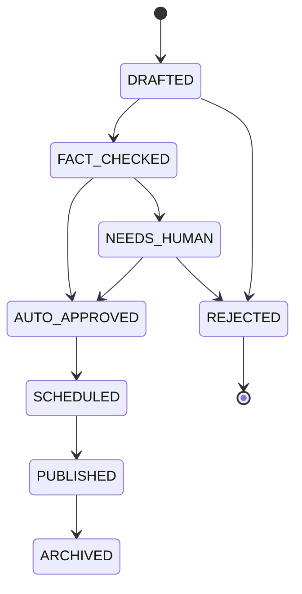

<!-- Written per the `the-loop:writing` skill: conclusions front-loaded, the
     mechanism drawn not described, EARS/schema registers kept formal. -->

# Requirements: `core` — Fact Bank schema, content state machine & source allowlist

> Phase 1 of 3 (requirements → design → tasks), Kiro spec approach. Must be reviewed and
> approved by the required collaborators before design.

## Introduction

`packages/core` is **the contract both planes import** — the one shared dependency between
Morsel's Content Plane (nightly, agentic, writes facts) and Serving Plane (online,
cache-first, reads facts). This work item delivers that contract as code: the **Fact Bank
schema** (SQLModel models + migrations), the **content-lifecycle state machine** (the
enum of states and the legal transitions between them), and the **source-allowlist types**
used to validate citations.

It is deliberately the first work item because it is the load-bearing decision of the whole
design (architecture §3.1, §6): every downstream piece — coordinator, researcher, verifier,
bake job, read API — is written against these types. It contains **no** business logic
(no agents, no read API, no pipeline) — only the schema, the state model, and the
validation query surface. Those consumers are separate work items built on top of it.

Grounded in [`docs/architecture.md`](../../architecture.md) §4.6 (data model), §4.2
(state machine), §5, §7 (D3–D5) and [`docs/product-spec.md`](../../product-spec.md) §6, §8.

## Requirements

### Requirement 1 — Fact Bank schema as the shared contract

**User story:** As an engineer building either plane, I want a single importable set of
typed models for facts, sources, allowlist, arcs, quiz and per-user state, so that both
planes speak one schema and it cannot drift between them.

#### Acceptance criteria (EARS)

1. WHEN `core` is imported THEN the system SHALL expose typed models for `Fact`,
   `FactSource`, `SourceAllowlist`, `ThemeArc`, `Quiz`, `User`, `UserFact`, and `Streak`,
   matching the entities and fields in architecture §4.6.
2. WHEN a `Fact` row is created THEN the system SHALL require `category`, `claim`, `state`,
   and a `theme_arc_id` reference nullable until scheduling, and SHALL default `state` to
   the initial lifecycle state (`DRAFTED`).
3. IF a `FactSource` row is written THEN the system SHALL require `fact_id`, `url`,
   `domain`, `source_tier`, `which_agent` (`researcher` | `verifier`), `supports_claim`,
   and `retrieved_at` (audit trail — D5, N3).
4. WHERE a field records a categorical choice (`state`, `image_style`, `which_agent`,
   `quiz_result`) the system SHALL model it as a constrained enum, not a free string.
5. WHEN the package is installed THEN it SHALL depend on neither `pipeline` nor `api`
   code (the one-membrane rule — architecture §6, N4); the dependency arrow points only
   inward.

### Requirement 2 — Content-lifecycle state machine with enforced legal transitions

**User story:** As the architect, I want the fact lifecycle encoded as an explicit state
enum plus a transition table, so that the coordinator advances facts through known states
and an illegal jump is a caught error, not silent corruption.

#### Acceptance criteria (EARS)

1. WHEN `core` is imported THEN the system SHALL expose a `FactState` enum with exactly:
   `DRAFTED`, `FACT_CHECKED`, `AUTO_APPROVED`, `NEEDS_HUMAN`, `SCHEDULED`, `PUBLISHED`,
   `ARCHIVED`, `REJECTED`.
2. WHEN a transition is requested THEN the system SHALL permit it only if it appears in the
   legal-transition set below, and SHALL raise a typed error otherwise.
3. WHILE a fact is in a terminal state (`REJECTED`, `ARCHIVED`) the system SHALL permit no
   outgoing transition.
4. WHEN the serving plane queries for deliverable facts THEN the contract SHALL make
   "only `PUBLISHED` rows" expressible as a single predicate (the read side never sees
   in-flight states — architecture §3.1).

The legal transitions (architecture §4.2) — the single source of truth this requirement encodes:

### Requirement 3 — Versioned source allowlist, validated by query not by LLM

**User story:** As the engineer building the verifier, I want "is this source allowed for
this category?" to be a SQL query against a versioned allowlist table, so that verification
is consistent, auditable, and independent of any per-call model judgement (D5).

#### Acceptance criteria (EARS)

1. WHEN a `SourceAllowlist` entry is defined THEN the system SHALL require `category`,
   `source_type`, `domain_pattern`, and an integer `version`.
2. WHEN asked whether a domain is allowed for a category THEN `core` SHALL answer from the
   allowlist rows (a query), never by calling a model.
3. WHERE multiple allowlist versions exist for a category THEN the contract SHALL let a
   caller resolve against a specific `version` (allowlist changes are versioned, not
   destructive — architecture F6, §7 watch-items).
4. WHEN a `FactSource.domain` is checked THEN the system SHALL be able to record whether it
   matched an allowlist entry, preserving the per-fact audit trail (N3).

### Requirement 4 — Migrations and a seedable, reproducible schema

**User story:** As an engineer, I want the schema to materialize into Postgres via a
versioned migration and be seedable with the starting allowlist, so that any environment
(dev, CI, prod) reaches an identical, known state.

#### Acceptance criteria (EARS)

1. WHEN the migration runs against an empty Postgres database THEN it SHALL create every
   Fact Bank table with its constraints and enums, and SHALL be reversible.
2. WHEN the seed step runs THEN it SHALL load the starting `SourceAllowlist` (3–5 source
   types × 4 categories — capitals, food history, landmarks, trade history) from the
   `ops/` allowlist source, at `version = 1`.
3. IF the migration is applied twice THEN the second application SHALL be a no-op (idempotent),
   not an error.

## Non-functional requirements

- **Platform-agnostic (N4).** `core` SHALL contain no coupling to PWA/native/API framework
  choices — pure schema + types usable by any consumer over the DB.
- **Postgres, not SQLite (D9).** Types SHALL use Postgres-appropriate column types (native
  enums, `uuid`, `date`, `timestamptz`) so JSON and concurrent writers are supported later.
- **Auditability (N3).** The schema SHALL retain, per published fact, the sources and the
  agent/confidence trail that approved it — no field is dropped after publish.
- **Additivity (N6).** `UserFact.srs_state` and personalization-supporting fields SHALL be
  present but unused, so later phases (SRS, personalization) are additive, never a rewrite.

## Security considerations

> Threat-model-lite (`security.threatModel.required`). This work item is an internal schema
> library with **no runtime request surface of its own** — it defines tables and types; it
> serves no traffic and authenticates no one. The attack surface it *shapes*, however, is
> real, because untrusted content flows into these tables from the pipeline.

- **Actors & trust:** Direct callers are trusted first-party code (pipeline, api, migrations).
  The **data** that lands in `Fact.claim`/`hook`, `FactSource.url`/`domain`, and
  `image_attribution` originates from **untrusted** sources: LLM-generated text and
  third-party web pages/images the researcher retrieved. `core` does not fetch or render;
  it stores.
- **Trust boundaries & data:** The boundary is write-time (pipeline → Fact Bank) and
  read-time (Fact Bank → bake → client). `core` holds **no secrets, tokens, or PII** beyond
  `User` identity keys; auth/PII handling belongs to the serving-plane user-state work item,
  not here. The schema SHALL NOT store credentials in any fact/source field.
- **Abuse cases (EARS):**
  1. WHEN a `FactSource.url`/`domain` or `Fact.claim` contains markup or control characters
     THEN the schema SHALL store it as inert text (no field is interpreted/executed by
     `core`); rendering-time escaping is the consumer's contract, and this requirement
     records that boundary rather than silently assuming it.
  2. WHEN a caller attempts to set `state = PUBLISHED` directly from `DRAFTED` THEN the
     transition guard SHALL reject it (no bypass of verification/QA — R2).
  3. WHEN an allowlist check is attempted for a category with no allowlist rows THEN the
     system SHALL fail closed (treat the source as **not** allowed), never open.
- **Fail closed:** Absent/ambiguous allowlist coverage → source rejected. Unknown/invalid
  `state` value → rejected at the type boundary (native enum). No implicit default that
  advances a fact toward `PUBLISHED`.

## Out of scope

- The researcher, verifier, image step, coordinator, scheduler, bake job, read API — every
  behavioural consumer of the schema (separate work items).
- Authentication, account management, and PII handling (serving-plane user-state item).
- The `internet-culture` category and its distinct freshness fields (deferred — architecture §10 Phase 5).
- FACT_LINKS / connect-the-dots edges and SRS scheduling logic (schema leaves room via
  `srs_state`; the logic is Phases 2–3).

## Open questions

Raised as ticket comments once the ticket exists (paper trail), linked here:

1. **Enum home** — native Postgres enums vs. app-level `str` enums with a check constraint?
   (Migration ergonomics vs. strictness — settle in design.)
2. **Transition guard placement** — enforce legal transitions in the Python model layer, a
   DB trigger/constraint, or both? (Depth of the R2 guarantee — settle in design.)
3. **Allowlist source of truth** — `ops/*.yaml` seeded into the table, or the table as
   primary with YAML as export? (Ties to architecture §7 allowlist-versioning watch-item.)

## Review comments

> Appended by the-loop's `record-feedback` hook when a human gate approves with comments.
