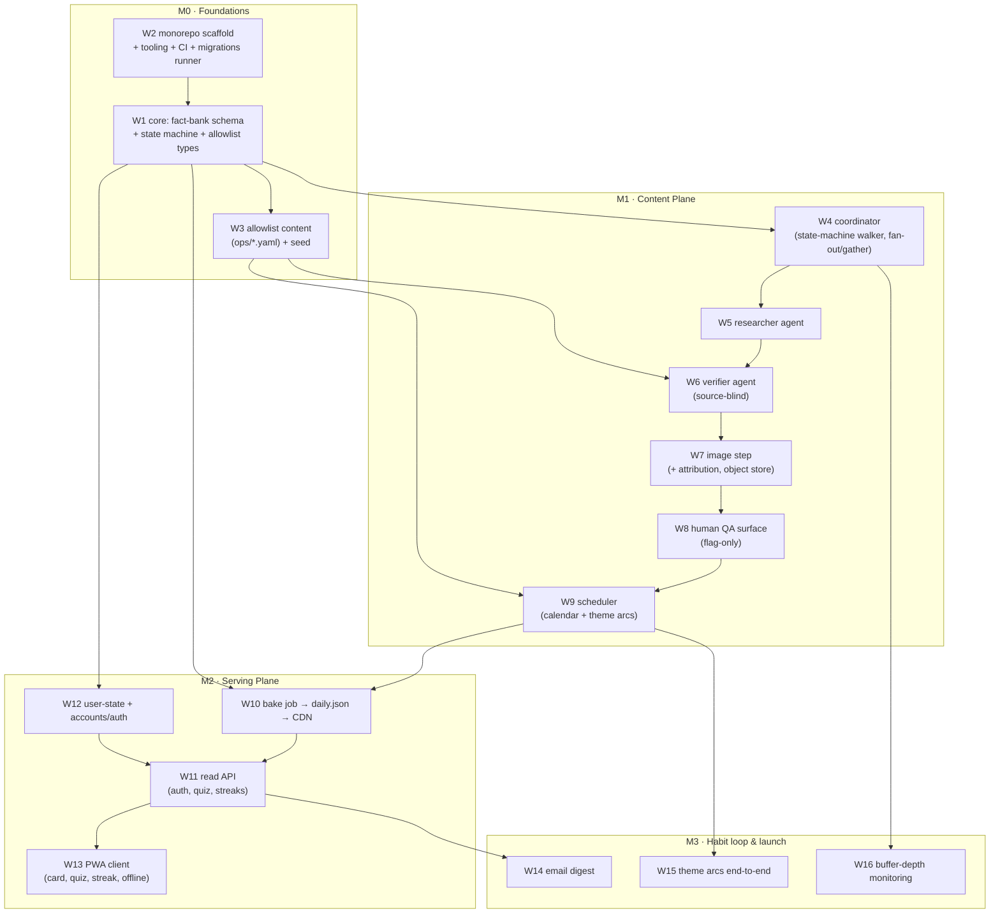

<!-- Written per the `the-loop:writing` skill: conclusion-first, the mechanism
     drawn not described, EARS kept formal. This is an EPIC/roadmap breakdown —
     it decomposes the MVP into work items; each work item gets its OWN
     requirements → design → testing-plan → tasks chain later. -->

# Requirements: MVP delivery plan — milestones & work-item breakdown

> Phase 1 (requirements) for a **roadmap epic**. Its deliverable is the decomposition of
> the product spec + architecture into an ordered set of work items grouped into
> milestones, each traced to the source requirements and its dependencies. It does **not**
> replace the per-work-item spec chains — it sequences them.

## Introduction

[`docs/product-spec.md`](../../product-spec.md) and [`docs/architecture.md`](../../architecture.md)
define the Morsel MVP. This epic translates them into **milestones and work items** so the
team can execute one the-loop work item at a time in dependency order, without losing the
whole-MVP picture.

The source requirements are already enumerated in the docs — this epic **references** them
rather than restating them:

- **Functional:** F1–F11 (architecture §2.1).
- **Non-functional:** N1–N6 (architecture §2.2).
- **Decisions:** D1–D9 (architecture §7) constrain *how* items are built.

The unit of the breakdown is a **work item** (`W#`) — a slice small enough for one spec
chain and PR. Milestones (`M#`) group work items into shippable increments.

## The breakdown at a glance

## Requirements

Each requirement below is one **milestone**; its acceptance criteria are the **work items**
that, when their own spec chains complete, satisfy it. The "→ F/N/D" tags trace each work
item to the source docs.

### Requirement 1 — M0 · Foundations (the contract + a place to build)

**User story:** As an engineer, I want the shared schema, a working monorepo, and seeded
allowlist content, so that every later plane is written against one stable contract.

#### Acceptance criteria (EARS)

1. WHEN M0 is complete THEN the repo SHALL contain **W1 `core`**: the Fact Bank schema,
   the `FactState` lifecycle enum with a legal-transition guard, and source-allowlist
   types (→ F6, N3, N4, N6). *(Requirements already drafted — `docs/specs/draft-core-fact-bank/`.)*
2. WHEN M0 is complete THEN the repo SHALL contain **W2 monorepo scaffold**:
   `packages/{core,pipeline,api,web}`, root tooling (uv/ruff/pyright/pytest per config),
   CI running the same commands, and a migrations runner against Postgres (→ N4, D9).
3. WHEN M0 is complete THEN **W3 allowlist content** SHALL exist as `ops/*.yaml`
   (3–5 source types × 4 categories) and seed into `SourceAllowlist` at `version = 1`
   (→ F6).

### Requirement 2 — M1 · Content Plane (produce verified facts)

**User story:** As the product, I want the nightly pipeline to research, verify, illustrate,
and human-gate facts into the bank, so that a multi-day buffer of `PUBLISHED` facts exists.

#### Acceptance criteria (EARS)

1. WHEN M1 is complete THEN **W4 coordinator** SHALL walk the state machine deterministically
   with fan-out/gather over N candidates, checkpointing each stage to the DB (→ F5, N2, D2, D3, D6).
2. WHEN M1 is complete THEN **W5 researcher** SHALL draft `{claim, hook, difficulty, quiz}`
   with retrieved citations, writing a `DRAFTED` row (→ F5).
3. WHEN M1 is complete THEN **W6 verifier** SHALL receive the claim **only**, search the
   category allowlist, emit `{confidence, supporting_source}`, and route to
   `AUTO_APPROVED`/`NEEDS_HUMAN` (→ F5, F6, D4).
4. WHEN M1 is complete THEN **W7 image step** SHALL branch on `image_style`, capture
   attribution for licensed photos, and store to the object store (→ F8, D7).
5. WHEN M1 is complete THEN **W8 human-QA surface** SHALL list only `NEEDS_HUMAN` rows with
   their verification trail and offer approve/reject (→ F7).
6. WHEN M1 is complete THEN **W9 scheduler** SHALL assign `AUTO_APPROVED` candidates to
   `publish_date`s honoring weekly theme arcs and near-term dedup (→ F9, D1).

### Requirement 3 — M2 · Serving Plane (deliver the card + user state)

**User story:** As a user, I want to open the app and get today's card fast (even offline),
answer the quiz, and keep my streak, so that the 30-second ritual works.

#### Acceptance criteria (EARS)

1. WHEN M2 is complete THEN **W10 bake job** SHALL emit the next day's `daily.json`
   (fact + image URL + quiz, answers withheld) to the CDN, from `PUBLISHED` rows only (→ N1, F1).
2. WHEN M2 is complete THEN **W12 user-state + accounts** SHALL provide account-gated
   identity via managed auth and the `USERS`/`USER_FACT`/`STREAKS` tables (→ F4, D9).
3. WHEN M2 is complete THEN **W11 read API** SHALL serve the read path, accept quiz answers,
   and update streaks with the freeze allowance (→ F1, F2, F3, F4).
4. WHEN M2 is complete THEN **W13 PWA client** SHALL render the daily card + quiz + streak
   and cache today's card in a service worker for offline (→ F1, F2, F3, F11).

### Requirement 4 — M3 · Habit loop & launch readiness

**User story:** As the product, I want reminders, narrative arcs, and buffer monitoring, so
that the habit sticks and a bad night never ships an empty card.

#### Acceptance criteria (EARS)

1. WHEN M3 is complete THEN **W14 email digest** SHALL send a daily reminder via cron +
   template (→ F10, D8).
2. WHEN M3 is complete THEN **W15 theme arcs** SHALL be wired end-to-end (authoring →
   scheduling → card) (→ F9).
3. WHILE the pipeline runs THEN **W16 monitoring** SHALL alert when the `AUTO_APPROVED`/
   `SCHEDULED` buffer depth falls below the multi-day threshold (→ N5).

## Non-functional requirements

- **Dependency order is a hard constraint.** No work item starts before the items its
  arrow depends on (diagram above) are at least at a locked design (schema/interfaces
  stable). W1 `core` gates most of the tree.
- **Each work item is independently shippable behind the membrane** (architecture §3.1):
  content-plane items land without touching the serving plane and vice-versa, once `core`
  exists (N4).
- **Web Push is explicitly out of MVP** (fast-follow, architecture §10 Phase 1); email
  digest (W14) carries reminders for launch (D8).

## Security considerations

> Threat-model-lite for the **planning epic itself**. This work item produces documents —
> a milestone breakdown — and ships **no code and no runtime surface**, so it introduces
> **no new attack surface** of its own.

- **Actors & trust:** Authors/readers are first-party (product, architect, engineers). The
  content is a roadmap; it stores no user data, secrets, or third-party input.
- **Trust boundaries & data:** None crossed by this artifact. The *security work* lives in
  the individual work items and is gated there — each of W1–W16 carries its own Security
  considerations at its requirements phase. Two are flagged now so they are not forgotten:
  **W11/W12** (auth, quiz-answer integrity, streak tampering — the real request surface)
  and **W7** (image licensing/attribution — legal, not just technical).
- **Abuse cases (EARS):** n/a for a planning doc — deferred to each work item's own
  requirements.
- **Fail closed:** n/a here; the fail-closed obligations are stated per item (e.g. `core`'s
  allowlist fail-closed, verifier source-blindness).

## Out of scope

- All post-MVP phases (architecture §10): Web Push, SRS, connect-the-dots, personalization,
  internet-culture pipeline, knowledge map, native app.
- The **content** of any single work item's requirements/design — those are authored in
  each item's own `draft-*`/`<id>` folder, not here.

## Open questions

The docs are clear enough to execute M0 and most of M1 (see clarity assessment in the
hand-off note). The architecture's own open questions (§11) are **watch-items**, not
blockers, and attach to specific later work items rather than gating the plan:

1. **Verifier "independence" definition** beyond "distinct domain" — attaches to **W6**;
   ship crude, track per-category rejection rate. Not a blocker for W1–W5.
2. **Image hybrid ratio + licensing** — attaches to **W7**.
3. **Canonical publish boundary (UTC cutoff)** for global "today" — attaches to **W9/W10**.
4. **Human-QA staffing cadence** — attaches to **W8**; flag-only keeps it small at MVP.

## Review comments

> Appended by the-loop's `record-feedback` hook when a human gate approves with comments.
